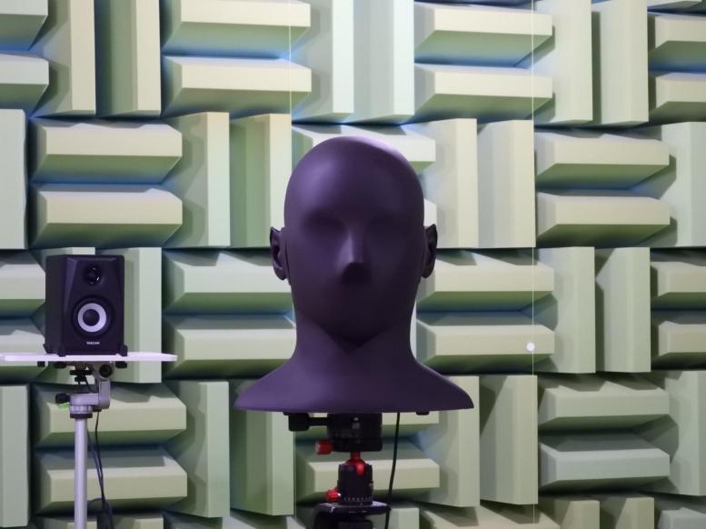

# HRIR Data

This page aims at making a set of measured [HRIR](https://en.wikipedia.org/wiki/Head-related_transfer_function) of SAMREC Type 2500R available for download. Our HRIR data were measured in the full azimuth range, 0 to 360, with 5-deg increments, 0 elevations. HRIRs contain [binaural cues](https://en.wikipedia.org/wiki/Sound_localization#ITD_and_IID) which are useful for localizing a sound source in the horizontal plane.

- [DEMO: Sound localization in an anechoic room](https://youtu.be/lq4Aa0xdxbU)

### Dummy Head: SAMREC Type 2500R

The photo below shows the dummy head we used during HRIR measurements in the anechoic room of the Department of Computer Science and Electrical Engineering at Kumamoto University - JAPAN. For more details about the dummy head, check the following link: [https://shop.miyaji.co.jp/SHOP/ka-r-021716-ay04.html](https://shop.miyaji.co.jp/SHOP/ka-r-021716-ay04.html)

  

### Outline of HRIR Measurement

The measurements consist of left and right ear [impulse response](https://en.wikipedia.org/wiki/Impulse_response)s (IRs) from a [TASCAM VL-S3](https://tascam.com/us/product/vl-s3/spec) loudspeaker placed about 1.5m from the center of the dummy head. The optimized Aoshima's time-stretched pulse (OATSP) ([Y. Suzuki *et al.*, 1995](https://doi.org/10.1121/1.412224)) was used as a source signal to measure the impulse responses at a sampling rate of 44.1 kHz.
