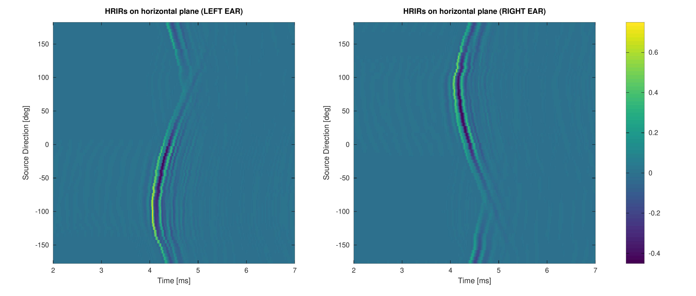

# HRIR Data

This page aims at making a set of measured [HRIR](https://en.wikipedia.org/wiki/Head-related_transfer_function) of SAMREC Type 2500R available for download. Our HRIR data were measured in the full azimuth range, 0 to 360, with 5-deg increments, 0 elevations. HRIRs contain [binaural cues](https://en.wikipedia.org/wiki/Sound_localization#ITD_and_IID) which are useful for localizing a sound source in the horizontal plane.

- [DEMO: Sound localization in an anechoic room](https://youtu.be/lq4Aa0xdxbU)

## Dummy Head: SAMREC Type 2500R

The photo below shows the dummy head we used during HRIR measurements in the anechoic room of the Department of Computer Science and Electrical Engineering at [Kumamoto University](https://ewww.kumamoto-u.ac.jp/en/) - JAPAN. For more details about the dummy head, check the following link: [https://shop.miyaji.co.jp/SHOP/ka-r-021716-ay04.html](https://shop.miyaji.co.jp/SHOP/ka-r-021716-ay04.html)

  

## Outline of HRIR Measurement

The measurements consist of left and right ear [impulse response](https://en.wikipedia.org/wiki/Impulse_response)s (IRs) from the [TASCAM VL-S3](https://tascam.com/us/product/vl-s3/spec) loudspeaker placed about 1.5m from the center of the dummy head. The optimized Aoshima time-stretched pulse (OATSP) ([Y. Suzuki *et al.*, 1995](https://doi.org/10.1121/1.412224)) was used as a source signal to measure the IRs at a sampling rate of 44.1 kHz. The length of the TSP was set to 16383 samples. The dummy head was rotated every 5 degs from 0 to 355 degs. The photo below shows the measurement setup. (Note: Our HRIR data might contain some erros because we rotated the dummy head manually)

  

## Download HRIR Data

You can download our HRIRs from the link below:

- [SAMREC-2500R-HRIR-Dataset.zip](https://docs.google.com/uc?export=download&id=1sE_hguW_fbdW51SlPPxAww8DdEMBSjqM)

The half-[hanning window](https://en.wikipedia.org/wiki/Hann_function) was applied to the HRIRs to eliminate any possible reflections as suggested by Kanji Watanabe in his paper ([K. Watanabe *et al.*, 2014](https://www.jstage.jst.go.jp/article/ast/35/3/35_E1368/_article)). Figure below shows the measured HRIRs for the left and right ears.

  

The change of HRIRs is sinusoidal because the arrival time depends on the distance from the loudspeaker to the ear.

  

HRTFs (in dB) for both ears vary according to sound source direction.
